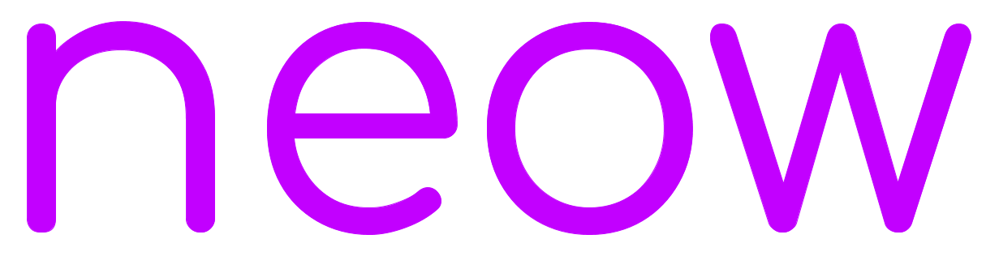

# neow

[Click here to try neow and experience euphoria](https://neow.matthewevan.xyz)

An absurdly coded chat, bb, and gambling site with a currency, neowcoins.

## Get InVoLvEd!

There's a lot of stuff wrong with this site. Mostly, with organizational issues. Oh, and when I was little I didn't properly tab things so, yeah.

## Installation

Listen, who ever you are, reading this, I need you to do me a favor. I need you to find an acid with enough ph to dissolve anything. Then, I need you to crack open my skull and pour it on my brain.

Not really. I didn't make this website to be portable. It was my first PHP coding project and I didn't really plan ahead. Most of this stuff you could find from tutorials online. I'm not going to give you exact instructions. Maybe later, but I'll give you a general idea.

### Prerequitites

* Apache web server (no you can't use nginx unless you can get .htaccess files to be interpereted, that is important) with php support
* Mysql database with proper entries (check the sql statement in the code, or I'll add the sql code later, who knows)

### Setup

1. Clone to /var/www/
2. Setup mysql database (mariadb is best) with a database named neow and two tables, users, and board.
3. Start mysql
4. Configure config.php with sql database settings
5. Add entry to apache config so the website runs
6. Pray to your God of your choosing
7. Start the apache web server.
